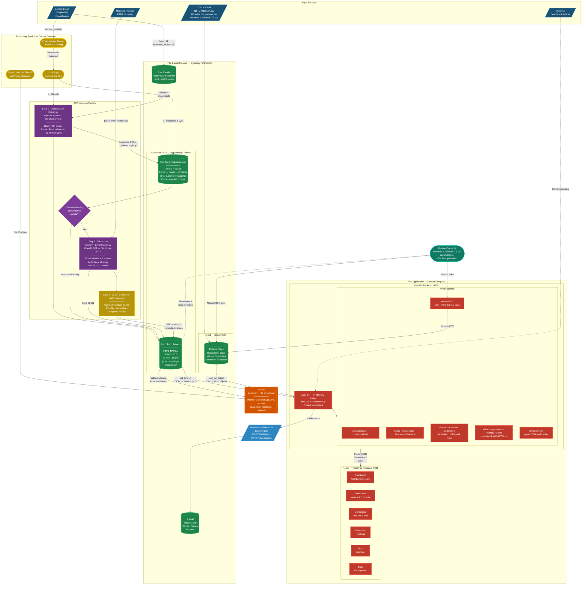

# System Architecture



## Shape Legend

| Shape | Meaning | Used For |
|-------|---------|----------|
| **Parallelogram** `/text/` | Input / Output | Data sources, generated documents |
| **Cylinder** `[(text)]` | Database / Data Store | NAS file storage, JSON registries, CSVs |
| **Rectangle** `[text]` | Process | AI extraction, graph generation, API routes |
| **Rounded** `([text])` | Terminal / Actor | Monitor loops, human intervention |
| **Diamond** `{text}` | Decision | Performance update check |
| **Double-bordered** `[[text]]` | External Service | Notion integration |
| **Solid arrow** `-->` | Data flow | Primary pipeline connections |
| **Dashed arrow** `-.->` | Optional / async flow | Benchmarks, manual file moves |

## Data Flow Summary

```
Email (Outlook) ──→ Download ──→ Classify (GPT) ──→ Organize into Firm/Fund folders
                                                            │
                                                    ◇ Has performance?
                                                   ╱             ╲
                                                 Yes              No
                                                  │                └──→ Archive only
PDF Factsheets ─────────────→ Extract (GPT) ←─────┘
                                    │
                                    ▼
                            Fund JSON + Graphs ──→ Synology NAS (Source of Truth)
                                    │                    │
                                    │                    ├──→ Notion (Bi-directional Sync)
                                    │                    │
                                    ▼                    ▼
                            FastAPI Backend ←──── Load all data on startup
                                    │
                                    ▼
                            React Dashboard ──→ Interactive Analytics
                                    ▲
                                    │
                            Human Overwrite (Optional)
```

## Key Design Decisions

| Aspect | Decision | Rationale |
|--------|----------|-----------|
| **Database** | File-based (JSON + CSV on NAS) | No traditional DB; `firm_fund_mappings.json` is the single source of truth |
| **AI Engine** | OpenAI GPT (Agents SDK) | Structured extraction from unstructured PDFs and emails |
| **Monitoring** | Single polling loop + background threads | `monitor.py` orchestrates classify → extract → graph → sync cycle |
| **Web State** | In-memory Fund index | `state.py` loads all data at startup, thread-safe reload via API |
| **Sync** | Notion bi-directional, Email one-way in | Notion gets artifacts uploaded, meeting notes downloaded back |
| **Deployment** | Docker Compose (3 services) | backend, monitor, frontend as separate containers |
